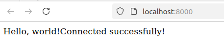

# This repository is to demo how to read environment variables in php

Some variables especially database credentials is sensitive.

## Install Dependencies

### Ubuntu

```
sudo apt update
sudo apt install php php-cli unzip php-mysql php-mysqli

curl -sS https://getcomposer.org/installer -o composer-setup.php
HASH=$(curl -sS https://composer.github.io/installer.sig)
php -r "if (hash_file('SHA384', 'composer-setup.php') === '$HASH') { echo 'Installer verified'; } else { echo 'Installer corrupt'; unlink('composer-setup.php'); } echo PHP_EOL;"

sudo php composer-setup.php --install-dir=/usr/local/bin --filename=composer

composer -v

sudo apt install mysql-server


```
### Windows

a. Install PHP

    1. Download PHP

        Go to the PHP for Windows page. https://windows.php.net/download/

        Choose the appropriate version (e.g., Thread Safe for development).

    2. Extract PHP

    3. Add PHP to path

    4. Verify php

        ```
        php -v
        ```

b. Install Composer

    1. Download Composer Setup
        https://getcomposer.org/download/
    2. Run the installer
    3. Verify
        ```
        composer --version
        ```
c. Install Mysql

## Setup Mysql Database

```
mysql -u root -p

CREATE USER 'your_user'@'localhost' IDENTIFIED BY 'your_password';

CREATE DATABASE database_name;

GRANT ALL PRIVILEGES ON database_name.* TO 'your_user'@'localhost';

FLUSH PRIVILEGES;

```

## Clone Project

```
git clone https://github.com/lhf552004/my_php_project
```
## Initialize

```
composer init
```

## Configure .env file

```
DB_HOST=localhost
DB_NAME=my_database
DB_USER=root
DB_PASSWORD=password

```
## Test

```
php -S localhost:8000
```

Access the url in browser

